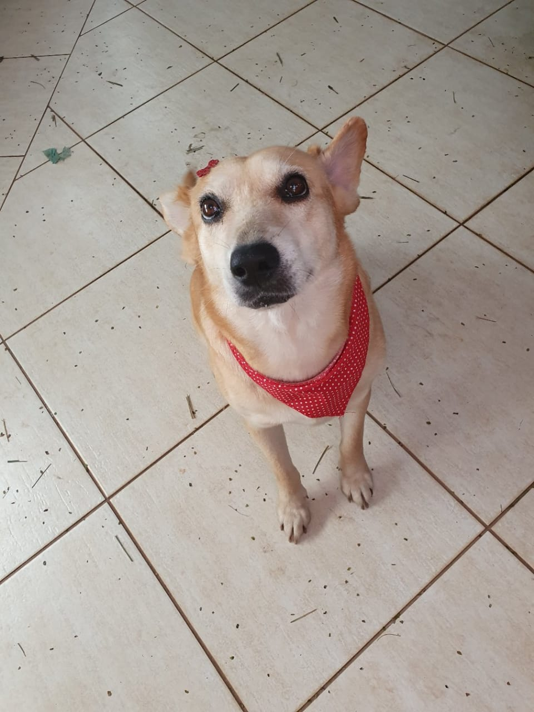

### Hi there, I'm Guilherme 👋

I came from the north of Paraná State, in Brazil, engineer by formation, already had my own bakery and I love tech.

- 🔭 I’m a student of Technology in Internet Systems at UTFPR-Toledo.
- 🌱 I’m currently learning **Python** and **Java**. Here are some of my projects:
  -  [My portfolio](https://guilhermag.github.io/portfolio/).
  - [My repositories](https://github.com/guilhermag?tab=repositories).
- 👯 I’m looking to collaborate on creating content about data analysis and how it changes the world.
- 🤔 I’m looking for help to find an internship, to get knowledge and experience.
- 💬 Ask me about new technologies, career changes and how to learn.
- 📫 How to reach me: By [email](guilhermag@gmail.com), [LinkedIn](https://www.linkedin.com/in/guilherme-gabriel-22961610a/), or [Instagram](https://www.instagram.com/guilherme.ag.93/)
- ⚡ Fun fact:  I have a dog 🐶, together with my fiancée we adopted her in 2018, she loves to dig and her name is Box

### Oi tudo bem ?, Eu sou o Guilherme 👋

Vim do norte do Paraná, engenheiro de formação, ja tive uma confeitaria e amo tecnologia.

- 🔭 Atualmente sou aluno de Tecnologia de Sistemas para Internet na UTFPR-Toledo.
- 🌱 Eu estou aprendendo sobre **Python** e **Java**. Aqui estão alguns dos meus projetos:
  -  [Meu portfólio](https://guilhermag.github.io/portfolio/).
  -  [Meus repositórios](https://github.com/guilhermag?tab=repositories).
- 👯 Eu espero colaborar na criação de conteúdo sobre a análise, apresentação de dados e como isso muda o mundo.
- 🤔 Eu procuro uma oportunidade de estágio para adquirir mais conhecimento e experiência.
- 💬 Me pergunte sobre novas tecnologias, mudanças de carreira e como aprender a aprender.
- 📫 Como me encontrar: Por [email](guilhermag@gmail.com), [LinkedIn](https://www.linkedin.com/in/guilherme-gabriel-22961610a/), ou [Instagram](https://www.instagram.com/guilherme.ag.93/)
- ⚡ Fato curioso: Eu tenho uma cachorra caramelo  🐶 , junto com a minha noiva adotamos ela no começo de 2018, ela adora cavar e o nome dela é Box.

